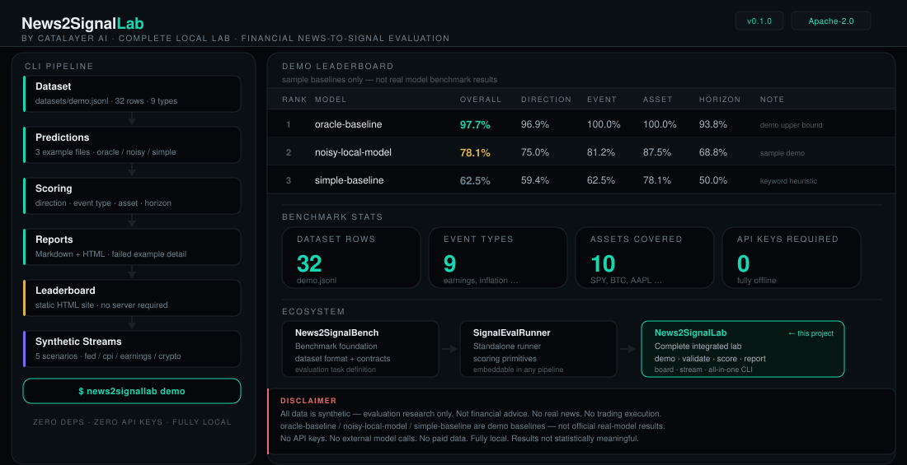

# News2SignalLab by Catalayer

**News2SignalLab** is a complete local-first lab for financial news-to-signal evaluation. It validates benchmark-style datasets, scores prediction files across four metrics, generates Markdown reports, builds a static HTML leaderboard, and produces synthetic market-news streams — entirely offline, with no API keys and no external dependencies.

> **Research only. Not financial advice. No trading execution. Synthetic demo data only.**



---

## What is News2SignalLab?

News2SignalLab is a self-contained local evaluation workflow for the financial news-to-signal task:

> Given a financial news headline, predict the expected market direction (bullish / bearish / neutral / mixed), event type, target asset, and time horizon.

The lab provides the full pipeline in a single CLI:

- A 32-row benchmark-style demo dataset with diverse event types and assets
- Three example prediction files at calibrated quality levels
- Transparent scoring across four metrics — direction, event type, asset, time horizon
- Markdown score reports with metric breakdowns and failed-example analysis
- A dark-theme static HTML leaderboard site with per-model report pages
- Five synthetic market-news event stream scenarios
- One command (`demo`) that runs the entire pipeline end-to-end

---

## Ecosystem

| Project | Role |
|---------|------|
| **News2SignalBench** | Benchmark foundation — dataset format and evaluation contracts |
| **SignalEvalRunner** | Standalone evaluation runner — scoring and reporting primitives |
| **News2SignalLab** | Integrated reference lab — full end-to-end workflow in one CLI |

News2SignalLab is a real, runnable project — not a collection of links. It brings these concepts together into one working local lab.

**Which project should you use?**
- If you only need the benchmark dataset standard and evaluation contracts → use **News2SignalBench**
- If you only need a standalone scoring runner to embed in your own pipeline → use **SignalEvalRunner**
- If you want the complete local workflow with reports, leaderboard, and synthetic streams → use **News2SignalLab**

See [docs/relation-to-bench-and-runner.md](docs/relation-to-bench-and-runner.md) for the full ecosystem design.

---

## Quick Start

```bash
# Install (editable, no external dependencies)
pip install -e .

# Run the full demo pipeline
news2signallab demo
```

The `demo` command runs the entire workflow and produces:

```
outputs/
  scores/
    oracle-baseline.json
    noisy-local-model.json
    simple-baseline.json
  reports/
    oracle-baseline.md
    noisy-local-model.md
    simple-baseline.md
  streams/
    fed-stream.jsonl
    cpi-stream.jsonl
    earnings-stream.jsonl
    crypto-policy-stream.jsonl
    regulation-stream.jsonl

site/
  index.html
  leaderboard.html
  reports/
    oracle-baseline.html
    noisy-local-model.html
    simple-baseline.html
  streams.html
  data/
    leaderboard.json
  assets/
    style.css
```

Open `site/index.html` in any browser — no server required.

---

## CLI Commands

### `news2signallab demo`

Runs the complete pipeline end-to-end.

```bash
news2signallab demo
```

### `news2signallab validate`

Validates a dataset and optionally a prediction file.

```bash
news2signallab validate --dataset datasets/demo.jsonl
news2signallab validate --dataset datasets/demo.jsonl --predictions examples/predictions/simple-baseline.jsonl
```

Checks:
- Valid JSONL (each line parses)
- Required fields present and non-empty
- Unique IDs
- Allowed label values
- Prediction IDs match dataset IDs (when both provided)

### `news2signallab score`

Scores a prediction file against a dataset.

```bash
news2signallab score \
  --dataset datasets/demo.jsonl \
  --predictions examples/predictions/simple-baseline.jsonl \
  --output outputs/scores/simple-baseline.json
```

Output is a JSON score file with overall score, per-metric breakdowns, and failed examples.

### `news2signallab report`

Generates a Markdown report from a score JSON file.

```bash
news2signallab report \
  --score outputs/scores/simple-baseline.json \
  --output outputs/reports/simple-baseline.md
```

### `news2signallab board`

Builds the static HTML leaderboard site from all score files in a directory.

```bash
news2signallab board \
  --input outputs/scores \
  --output site
```

Generates `site/index.html`, `site/leaderboard.html`, `site/reports/*.html`, `site/streams.html`, and `site/data/leaderboard.json`.

### `news2signallab stream`

Generates a synthetic market-news event stream.

```bash
news2signallab stream --scenario fed --count 20
news2signallab stream --scenario cpi --count 15 --output outputs/streams/cpi.jsonl
news2signallab stream --scenario earnings --count 10 --seed 42
news2signallab stream --list
```

Available scenarios: `fed`, `cpi`, `earnings`, `crypto-policy`, `regulation`

---

## Dataset Format

Datasets are JSONL files — one JSON object per line.

### Required Fields

| Field | Description |
|-------|-------------|
| `id` | Unique identifier |
| `headline` | News headline text |
| `event_type` | Event category |
| `asset` | Target asset ticker |
| `expected_direction` | `bullish` / `bearish` / `neutral` / `mixed` |
| `time_horizon` | `intraday` / `short_term` / `medium_term` / `long_term` |

### Example

```json
{
  "id": "n007",
  "headline": "Apple reports record quarterly revenue, beats EPS estimates by 8%, raises guidance",
  "source_type": "synthetic",
  "event_type": "earnings",
  "asset": "AAPL",
  "asset_type": "equity",
  "expected_direction": "bullish",
  "time_horizon": "intraday",
  "confidence": 0.90,
  "summary": "Apple beat both revenue and earnings estimates by wide margins and raised full-year guidance.",
  "published_at": "2024-10-31T21:00:00Z"
}
```

See [docs/dataset-format.md](docs/dataset-format.md) for full schema.

---

## Prediction Format

Prediction files are JSONL with one prediction per line.

### Required Fields

| Field | Description |
|-------|-------------|
| `id` | Must match a dataset row ID |
| `model` | Model or system name |
| `predicted_direction` | Direction prediction |

### Optional Fields

`predicted_event_type`, `predicted_asset`, `predicted_time_horizon`, `predicted_confidence`, `reasoning`

### Example

```json
{
  "id": "n007",
  "model": "simple-baseline",
  "predicted_direction": "bullish",
  "predicted_event_type": "earnings",
  "predicted_asset": "AAPL",
  "predicted_time_horizon": "intraday",
  "predicted_confidence": 0.70,
  "reasoning": "Keyword 'beats' reliably matched to bullish AAPL earnings."
}
```

See [docs/prediction-format.md](docs/prediction-format.md) for details.

---

## Example Prediction Files

> **Important:** The example prediction files listed below are **synthetic demo baselines created for illustration only**. They are not results from GPT, Claude, Gemini, Catalayer AI, or any real system. Do not cite or compare them as real model benchmarks.

| File | Description | Overall Score |
|------|-------------|---------------|
| `oracle-baseline.jsonl` | Synthetic upper-bound demo — near-perfect by design | ~97.7% |
| `noisy-local-model.jsonl` | Synthetic moderate-quality demo — illustrates mid-range scoring | ~78.1% |
| `simple-baseline.jsonl` | Synthetic keyword-heuristic demo — illustrates low-range scoring | ~62.5% |

These files exist solely to demonstrate how scoring, reports, and the leaderboard work with the 32-row synthetic demo dataset. They are not real model outputs. All scores are against synthetic benchmark data and have no bearing on real-world model performance.

---

## Static HTML Site

After running `news2signallab demo` or `news2signallab board`, open `site/index.html` in any browser.

The site includes:

- **Home** (`index.html`) — dataset stats, quick links, ecosystem overview
- **Leaderboard** (`leaderboard.html`) — ranked table with all metrics
- **Reports** (`reports/<model>.html`) — per-model score breakdown and failed examples
- **Streams** (`streams.html`) — synthetic stream viewer and scenario reference

The site is fully self-contained: no JavaScript frameworks, no external fonts, no CDN dependencies, no tracking.

---

## Synthetic Streams

The `stream` command generates synthetic event sequences from named scenario definitions.

```bash
news2signallab stream --scenario fed --count 20 --output outputs/streams/fed-stream.jsonl
```

Each event has a headline, event type, asset, expected direction, time horizon, and signal metadata.

All events are labeled `"source_type": "synthetic"` and contain `[Synthetic]` in the summary. They are not real news and should not be used for trading.

Available scenarios: `fed`, `cpi`, `earnings`, `crypto-policy`, `regulation`

See [docs/synthetic-streams.md](docs/synthetic-streams.md) for full documentation.

---

## Project Structure

```
News2SignalLab/
  README.md
  LICENSE                      Apache-2.0
  CHANGELOG.md
  pyproject.toml
  .gitignore
  news2signallab/
    cli.py                     argparse CLI entry point
    pipeline.py                full demo orchestration
    validate.py                dataset and prediction validation
    score.py                   scoring logic
    report.py                  Markdown report generation
    board.py                   static HTML site builder
    render.py                  HTML page templates
    stream.py                  synthetic stream generator
    types.py                   shared constants and dataclasses
    utils.py                   I/O and print helpers
  datasets/
    demo.jsonl                 32-row demo dataset
  examples/
    predictions/               three example prediction files
    streams/                   pre-generated stream examples
  scenarios/                   scenario definition JSON files
  templates/
    style.css                  standalone CSS (also embedded in HTML)
  docs/
    assets/
      news2signallab-demo.svg  README demo diagram
    architecture.md
    dataset-format.md
    prediction-format.md
    scoring.md
    synthetic-streams.md
    relation-to-bench-and-runner.md
    github-release.md
  scripts/
    smoke_test.sh              local CI smoke test
  outputs/                     generated by demo command (gitignored)
  site/                        generated static HTML site (gitignored)
```

---

## Roadmap

### v0.2 (next)
- Expand the synthetic dataset beyond the current 32-row demo set
- Add weighted scoring and CSV score export
- Improve synthetic stream variety and reduce template repetition
- Add richer per-metric breakdowns in reports and leaderboard pages

### Future ideas
- Deterministic reasoning-quality scoring (no judge model)
- Per-event-type and per-asset analysis drill-downs
- Scenario YAML editor for custom stream authoring
- Optional adapter interface for integrating external prediction pipelines

---

## Disclaimer

**Research only.** News2SignalLab is a local evaluation research tool.

- All dataset rows are **synthetic demo data** — not real financial news.
- All example prediction files (`oracle-baseline`, `noisy-local-model`, `simple-baseline`) are **synthetic demo baselines** — not real GPT, Claude, Gemini, or Catalayer AI results.
- Scores do not reflect real model capabilities on real market data.
- This tool does not execute trades, connect to brokers, or provide investment advice.
- No model provider APIs are called in v0.1. No API keys are required.
- No real news sources are used. No paid data sources are used.
- Do not use synthetic evaluation outputs to make financial decisions.
- Results from this lab **cannot and should not** be cited as official model performance benchmarks.

---

## License

Apache-2.0 — see [LICENSE](LICENSE)

© 2024-2026 Catalayer AI
